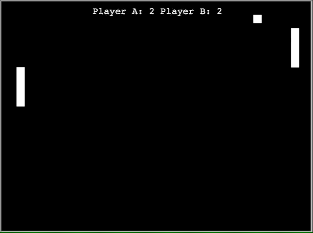

# Pong
## Small pong game written in Python3.

 This is a game displaying the functionalilty and ease-of-use turtles. Turtles is a popular way of introducing programming to students. Using this model not only helps explain the functionalilty of the language in Layman's Terms, but also gives a way of visually representing python as well.

 This was adapted and modified from the following source: https://www.youtube.com/watch?v=C6jJg9Zan7w&t=2301s 

